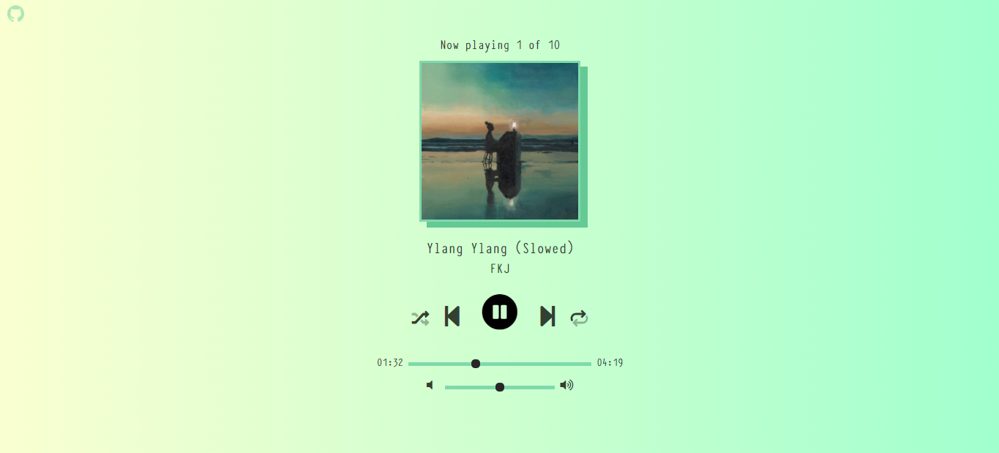

# Music Player

## [SITE HERE](https://isabdch.github.io/music-player/)

## 📖 Table of Contents

- [Project Description](#project-description)
- [Status](#status)

## ✏️ Project Description

This is a simple music player with some songs I enjoy hearing. You can control the volume, the current time of the song, etc. Also, I added the repeat and shuffle options. Each music has its own colors and page style. If you click on the artist's name you'll go to their Spotify profile. Enjoy!

Project is created with:

- ### HTML

- ### CSS

- ### JavaScript

## ⏱️ Status

This project is finished. 
